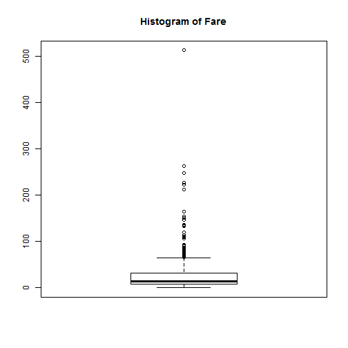
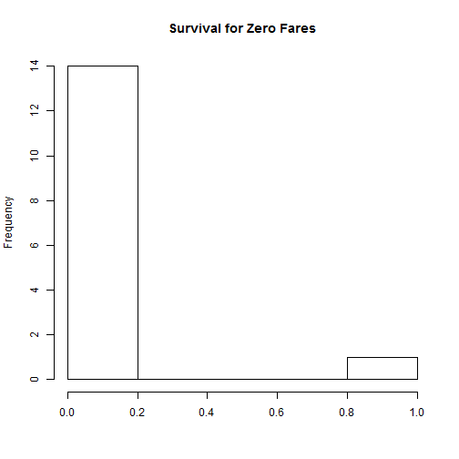
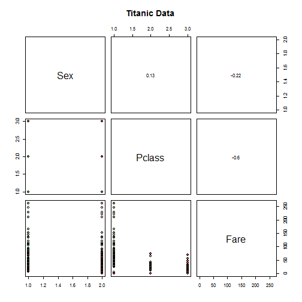

```r
library(dplyr)
library(ggplot2)
library(RColorBrewer)
```

### Data Summary
See what data looks like:

```r
trainingDF <- read.csv("data/train.csv")
str(trainingDF)
```

```
## 'data.frame':	891 obs. of  12 variables:
##  $ PassengerId: int  1 2 3 4 5 6 7 8 9 10 ...
##  $ Survived   : int  0 1 1 1 0 0 0 0 1 1 ...
##  $ Pclass     : int  3 1 3 1 3 3 1 3 3 2 ...
##  $ Name       : Factor w/ 891 levels "Abbing, Mr. Anthony",..: 109 191 358 277 16 559 520 629 417 581 ...
##  $ Sex        : Factor w/ 2 levels "female","male": 2 1 1 1 2 2 2 2 1 1 ...
##  $ Age        : num  22 38 26 35 35 NA 54 2 27 14 ...
##  $ SibSp      : int  1 1 0 1 0 0 0 3 0 1 ...
##  $ Parch      : int  0 0 0 0 0 0 0 1 2 0 ...
##  $ Ticket     : Factor w/ 681 levels "110152","110413",..: 524 597 670 50 473 276 86 396 345 133 ...
##  $ Fare       : num  7.25 71.28 7.92 53.1 8.05 ...
##  $ Cabin      : Factor w/ 148 levels "","A10","A14",..: 1 83 1 57 1 1 131 1 1 1 ...
##  $ Embarked   : Factor w/ 4 levels "","C","Q","S": 4 2 4 4 4 3 4 4 4 2 ...
```

```r
summary(trainingDF)
```

```
##   PassengerId     Survived         Pclass    
##  Min.   :  1   Min.   :0.000   Min.   :1.00  
##  1st Qu.:224   1st Qu.:0.000   1st Qu.:2.00  
##  Median :446   Median :0.000   Median :3.00  
##  Mean   :446   Mean   :0.384   Mean   :2.31  
##  3rd Qu.:668   3rd Qu.:1.000   3rd Qu.:3.00  
##  Max.   :891   Max.   :1.000   Max.   :3.00  
##                                              
##                                     Name         Sex           Age       
##  Abbing, Mr. Anthony                  :  1   female:314   Min.   : 0.42  
##  Abbott, Mr. Rossmore Edward          :  1   male  :577   1st Qu.:20.12  
##  Abbott, Mrs. Stanton (Rosa Hunt)     :  1                Median :28.00  
##  Abelson, Mr. Samuel                  :  1                Mean   :29.70  
##  Abelson, Mrs. Samuel (Hannah Wizosky):  1                3rd Qu.:38.00  
##  Adahl, Mr. Mauritz Nils Martin       :  1                Max.   :80.00  
##  (Other)                              :885                NA's   :177    
##      SibSp           Parch            Ticket         Fare      
##  Min.   :0.000   Min.   :0.000   1601    :  7   Min.   :  0.0  
##  1st Qu.:0.000   1st Qu.:0.000   347082  :  7   1st Qu.:  7.9  
##  Median :0.000   Median :0.000   CA. 2343:  7   Median : 14.5  
##  Mean   :0.523   Mean   :0.382   3101295 :  6   Mean   : 32.2  
##  3rd Qu.:1.000   3rd Qu.:0.000   347088  :  6   3rd Qu.: 31.0  
##  Max.   :8.000   Max.   :6.000   CA 2144 :  6   Max.   :512.3  
##                                  (Other) :852                  
##          Cabin     Embarked
##             :687    :  2   
##  B96 B98    :  4   C:168   
##  C23 C25 C27:  4   Q: 77   
##  G6         :  4   S:644   
##  C22 C26    :  3           
##  D          :  3           
##  (Other)    :186
```
There are lots of missing Cabins and imputation would suffice to make up these data. On the other hand, only 2 are missed for Embarked, we can just ignore those two. We might want to impute Age if the variable proves to be interesting.

#### Fare
The zero fare is worrysome and let's take a boxplot just to make sure

```r
boxplot(trainingDF$Fare, main = "Histogram of Fare")
```

 

The 500 outlier could be a problem. Let's see how many zeros we have:

```r
sum(trainingDF$Fare == 0)
```

```
## [1] 15
```
Not a lot. Free tickets? Let's see if they survived at all:

```r
hist(trainingDF %>% filter(Fare == 0) %>% `$`("Survived") %>% as.integer,
     main = "Survival for Zero Fares", xlab="")
```

 

Okay. Maybe I'll let the 500 ticket go but allow zeros to stay.

#### Clean up
We will filter out the max fare outlier and missing embarked.

```r
maxFare <- max(trainingDF$Fare)
trainingDF <- filter(trainingDF, 
                     Embarked != 0, 
                     Fare < maxFare)
```

### Preliminary Correlation Analysis
Firstly, let's examine raw correlation between each variable and survival:

```r
sapply(trainingDF, function(x){
  format(cor(as.numeric(x), trainingDF$Survived, use = "complete.obs"), digits=2)
})
```

```
## PassengerId    Survived      Pclass        Name         Sex         Age 
##   "-0.0069"         "1"     "-0.33"    "-0.061"     "-0.55"    "-0.079" 
##       SibSp       Parch      Ticket        Fare       Cabin    Embarked 
##    "-0.033"     "0.082"     "-0.17"      "0.26"      "0.28"     "-0.17"
```
We can make following observation:

1. The PassengerId and Name have close to 0 correlation as expected. 
2. With some surprise, Age doesn't seem have much impact. Neither do SibSp and Parch. 
    * We might consider cutting Age into Young, Middle Aged and Old to see if the children and elderly are more likely to survive, but they could cancelled out when computing naive correlation.
3. Ticket number has some interesting negative correlation and we might want to come back and see why this is. 
4. Embarked correlation is not very meaningful because embarked clearly is not ordinal variable. We shall visit it again later.
5. Otherwise, the most prominent factors seem to be Sex, Pclass, Fare.

The correlation is calculated based on complete observation so missing values shouldn't be a big concern. Together with the information we observed in the summary, we should consider **Sex, PClass, Fare** for now, and keep **Age, Ticket and Embarked** in our back pocket.

#### Age Study
TODO: We want to slice age into buckets and see if young/old have better survival rate then middle aged.

#### Ticket Study
TODO: We want to give ticket a closer look on why it has some promising correlation.

#### Embarked Study
TODO: We want to study whether Embarked location has correlation with Survival but the variable is not ordinal. Furthermore, it's likely correlated to other variables like Fare, Pclass.

### Pair-wise Scatter Plot
Bottom Left is pair-wise scatterplot and top right is correlation. Color denotes survival (green for survived and red for deceased)

```r
panel.pearson <- function(x, y, ...) {
horizontal <- (par("usr")[1] + par("usr")[2]) / 2; 
vertical <- (par("usr")[3] + par("usr")[4]) / 2; 
text(horizontal, vertical, format(cor(x,y, use = "complete.obs"), digits=2))
}

colors <- paste0(brewer.pal(3, "Set1"), "4D")[c(1,3)]

pairs(trainingDF[c("Sex", "Pclass", "Fare")], main = "Titanic Data", pch = 21, bg = colors[trainingDF$Survived + 1], upper.panel=panel.pearson)
```

 

The correlation is interesting and we might want to revisit when we start to consider covariance between variables.
