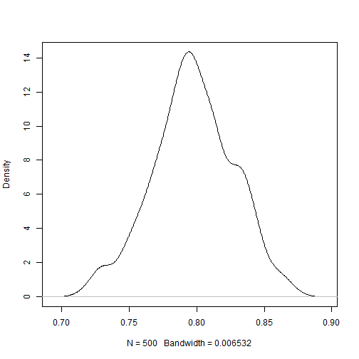

We want to validate our model. We will take 80% for training and 20% for validation. We might want to consider cross-validation in the future.

## Dataset

```r
library(dplyr)
library(randomForest)
df <- read.csv("../data/train.csv") %>%
  filter(Embarked != 0, Fare < max(Fare))

cross_validate <- function(predict, frac = 0.8, times = 500){
  set.seed(0)
  result <-
    sapply(1:times, function(x){
      training <- sample_frac(df, 0.8)
      test <- anti_join(df, training, by = "PassengerId")
      predict(training, test)
    })
  
  result %>%
    density %>%
    plot(main = "")
  mean(result)
}
```

## Gender Based Model

```r
cross_validate(function(training, test){
  gender <- lm(Survived ~ Sex, data = training)
  predicted <- round(predict(gender, test))
  sum(predicted == test$Survived) / nrow(test)
})
```

 

```
## [1] 0.7889
```

## Gender * (Pclass + Fare) Based Model

```r
cross_validate(function(training, test){
  genderclass <- glm(Survived ~ Sex * (Pclass + Fare), data = training)
  predicted <- round(predict(genderclass, test))
  sum(predicted == test$Survived) / nrow(test)
})
```

 

```
## [1] 0.7944
```

## Gender * (Pclass + Fare) Logistic Regression

```r
cross_validate(function(training, test){
  logit <- glm(Survived ~ Sex * (Pclass + Fare), data = training,
                     family=binomial(logit))
  predicted <- predict(logit, test) > 0
  sum(predicted == test$Survived) / nrow(test)
})
```

 

```
## [1] 0.7974
```

## Random Forest

```r
cross_validate(function(training, test){
  rf <- randomForest(as.factor(Survived) ~ Sex + Pclass + Fare, data = training)
  predicted <- predict(rf, test) == 1
  sum(predicted == test$Survived) / nrow(test)
})
```

 

```
## [1] 0.8036
```
